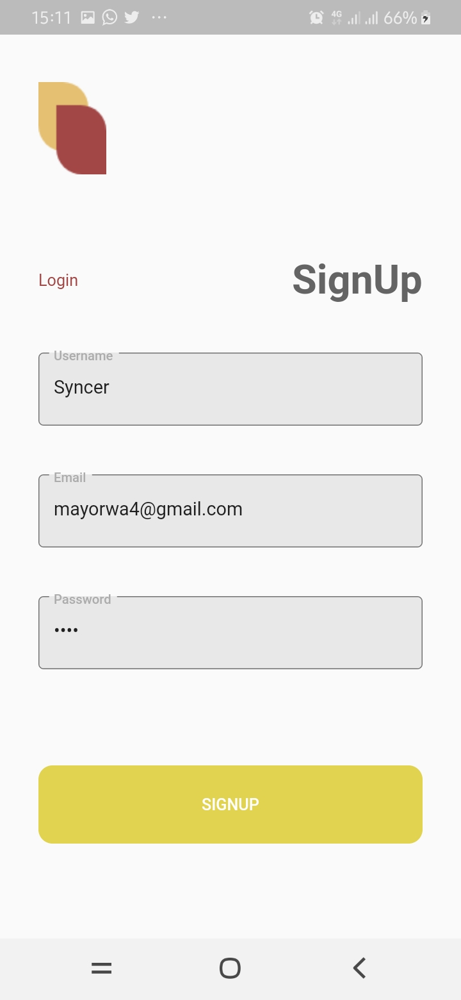
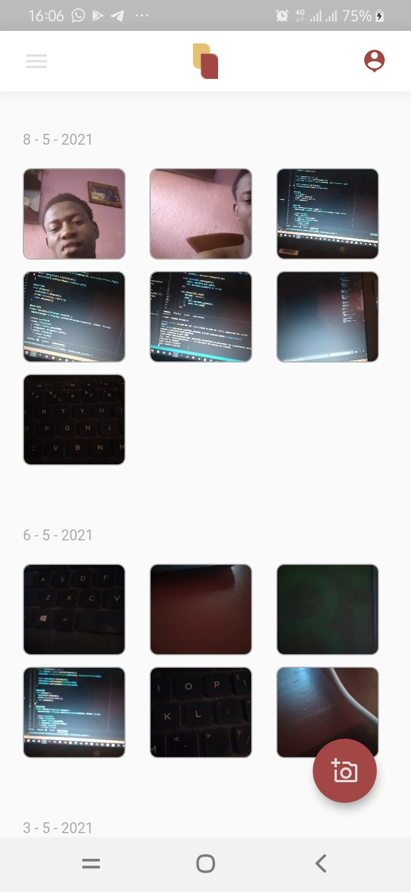
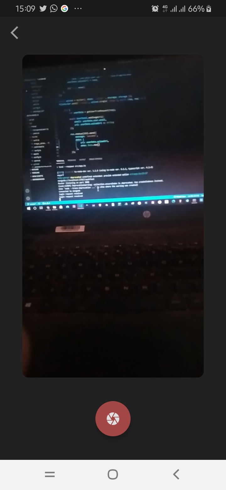

# App for Storing Memories 

A personal secure application that helps users to track their daily life and progress through images that are uploaded to an external server with unique captions.
This app has a backend that written in node js it recieves files and saves on the db [Image Cloud Store](https://github.com/mayor04/Image_Cloud_Store)

## Introduction
This apps uses the following plugin
 - camera
 - cupertino_icons
 - http
 - image_picker (for taking pictures)
 - path
 - path_provider
 - provider(it uses provider architecture)

## Images demo

